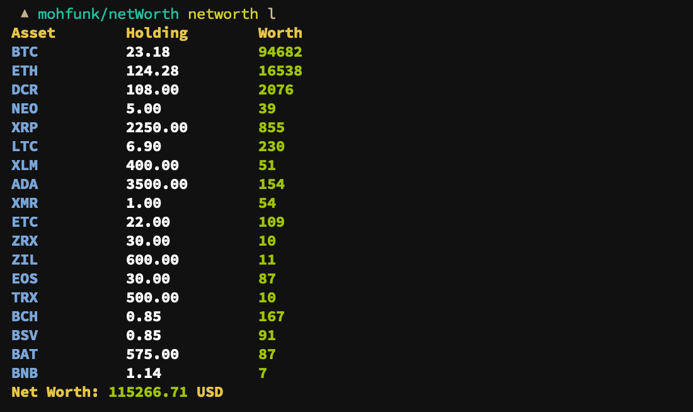

# `Money`
Tracks your networth


## Install

```bash
$ go get -u github.com/mohfunk/networth
```

## Commands

### Usage
```bash
$ networth <command> <args ...>

```
#### list
Lists all your assets
```bash
$ networth list # or networth l 
```

#### add
Adds an asset
```bash
$ networth add <Symbol> <Name> # or networth a

# Example
$ networth add BTC bitcoin

```

#### modify
```bash
#                           +/-
$ networth modify <Symbol> <Sign> <Quantity> # or networth mod/m

# Example
$ networth m BTC + 2.3
$ networth m DCR - 14
```
Modify your holdings.


