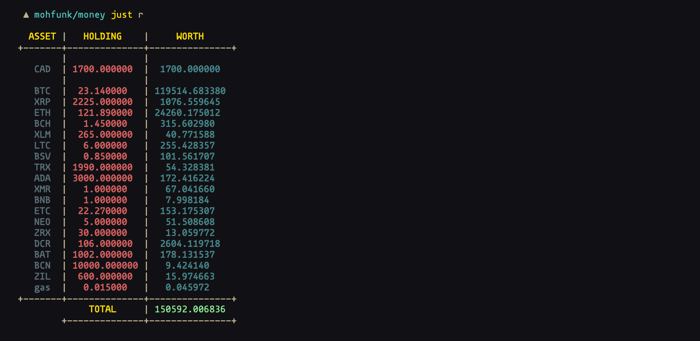

[](https://goreportcard.com/report/mohfunk/money) [](https://godoc.org/github.com/mohfunk/money)
# `Money`
Manage your finances from the terminal   


## Install
you need to have go installed, please refer to [Download
Go](https://golang.org/dl)   

To install `money`:
```bash
$ go get -u github.com/mohfunk/money
```

## Usage
```bash
$ money -flags <command> <args ...>
```

## Commands

### list
Lists all your assets
```bash
$ money ls
```
**Alias** `$ money l`

### ad
Adds a new asset type
```bash
#                                  optional    for metals 
$ money ad -flags <name> <symbol> <quantity> <quantity unit>
```
**Alias** `$ money a`

##### Flags
| flags | function |
|:-----:|:--------:|
|  -f   | adds asset as a fiat currency |
|  -c   | adds asset as a cryptocurrency |
|  -m   | adds asset as a precious metal |

##### Example
```bash
# Fiat Currencies
$ money ad -f us-dollar USD
$ money ad -f ca-dollar CAD 343.23
# Cryptocurrencies
$ money ad -c bitcoin BTC
$ money ad -c cardano ADA 5356 
# Precious Metals
$ money ad -m gold SLV 999 g
$ money ad -m gold GLD 0.5 kg
```

### md
Modifies holding quantity for an asset
```bash
#                       + or -
$ money modify <symbol> <sign> <quantity>
```
**Alias** `$money m`

##### Example
```bash
$ money m CAD + 25000
$ money m BTC + 0.329
$ money m SLV - 12 kg
```


